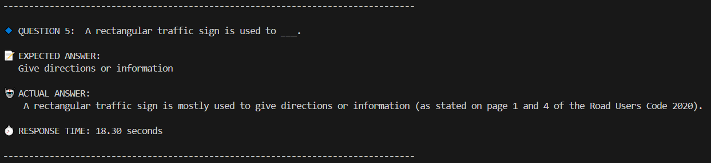
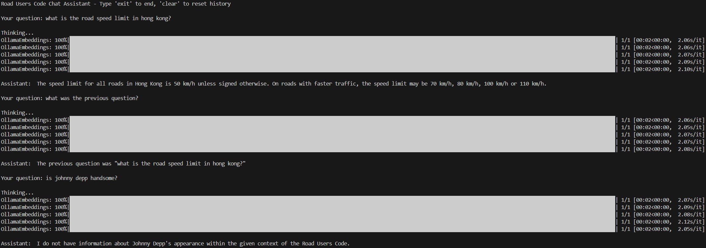

# Road Users Code RAG Application

A conversation AI assistant for practicing Hong Kong driving license written exams.

## Demo

### Test Result Example
Sample test result of a random question from online driving license exam questions example.  


### Chat Example
Example of chat with the chatbot.  


---

## Requirements

- **Python 3.x** (tested with Python 3.10.15)
- **Dependencies:**
  - [LangChain](https://github.com/hwchase17/langchain) and its necessary packages
  - [pandas](https://pandas.pydata.org/)
  - [ollama](https://ollama.ai/) for pulling and running the required embedding and chat models

Install dependencies:
```bash
pip install langchain pandas ollama
```

---

## How to Run

The project is structured into several modules addressing training, chatting, and testing. You can run them as follows:

1. **Training (Vector Database Creation):**  
   Building vector database from the content in *Road Users Code* PDF:
   ```bash
   python train.py

2. **Chat (Interactive RAG Chat Session):**  
   Starting the interactive chat session:
   ```bash
   python chat.py

3. **Testing (Performance and Accuracy Evaluation):**  
   Executing test suite for evaluating response times and validate answers:
   ```bash
   python test.py

4. **Main Menu:**  
   Launching a menu-driven interface:
   ```bash
   python main.py

---

## How Does It Work
The *Road Users Code* RAG Application leverages Retrieval-Augmented Generation (RAG) techniques as follows:

### Training Phase:
- **PDF Processing:**
Loads the *Road Users Code* PDF and splits it into manageable text chunks.
- **Embedding Generation:**
Uses the nomic-embed-text model (via Ollama) to generate vector embeddings for each chunk.
- **Vector Database Creation:**
Stores the embeddings in a persistent vector database using LangChain's Chroma vector store.
### Querying/Chat Phase:
- **Interactive Query:**
The user submits a query, which is processed by the application.
- **Context Retrieval:**
The system retrieves relevant text chunks from the vector database based on the query.
- **Answer Generation:**
The retrieved context and conversation history are passed to the mistral chat model to generate a context-aware response.
### Testing Phase:
- **Automated Testing:**
Processes test cases (from a CSV file) to evaluate performance and accuracy.
- **Metrics Collection:**
Measures response times and compares the generated answers against the expected output.
- **Result Reporting:**
Logs detailed results to a CSV file and outputs a summary for review.

---

## Implementation
The project is modularized into several Python scripts:

- **train.py:**
    - Loads the *Road Users Code* PDF.
    - Splits the document into manageable chunks.
    - Generates embeddings for each chunk using the nomic-embed-text model.
    - Creates and persists a vector database using LangChain's Chroma vector store.
- **chat.py:**
    - Implements an interactive chat interface.
    - Retrieves relevant context from the vector database.
    - Uses the mistral chat model for generating responses.
    - Maintains conversation history and processes commands such as clear and exit.
- **test.py:**
    - Automates performance and accuracy testing by processing test cases from a CSV file.
    - Measures response times and compares generated answers with expected results.
    - Logs detailed test metrics and clears the chat session history post-testing.
- **main.py:**
    - Provides a menu-driven interface to select between training, chat, or testing functionality.
    - Redisplays the menu after the completion of each operation for continued use."# Road-Users-Code-RAG-Application" 
